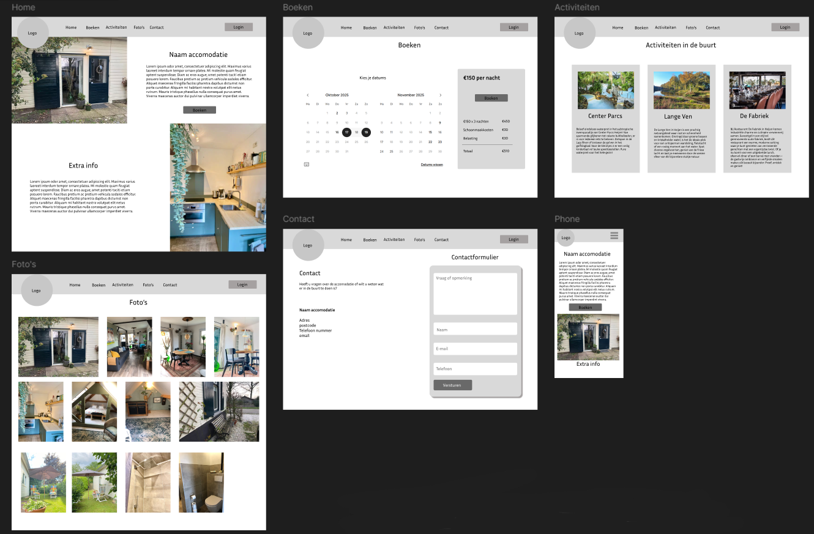
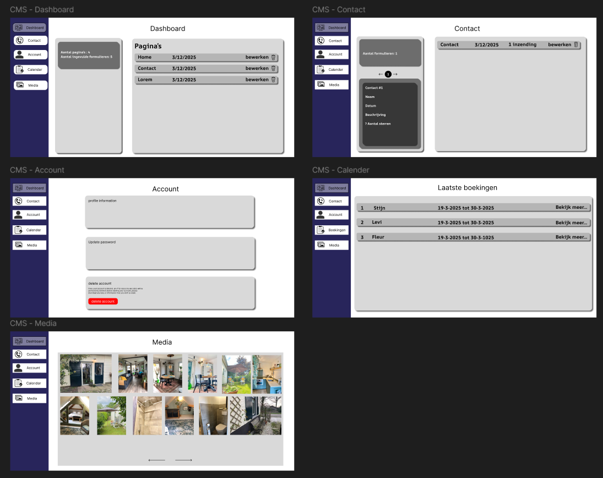

## Het project

In dit project gaan we een CMS systeem maken voor een B&B, in dit CMS kun je pagina's toevoegen, verwijderen of aanpassen, je kunt foto's toevoegen en verwijderen en je kunt je eigen kleuren thema kiezen.
En we maken het project met Laravel.

## Het design

  

Hierboven komt het design wat wij hebben gemaakt voor de B&B, dit design is de basis voor de website, hierin kun je de tekst, kleuren en afbeeldingen aanpassen.

## CMS design

  

Hierboven komt het design wat wij hebben gemaakt voor het CMS systeem, hierin kun je dus alles aanpassen zoals jij dat zou willen.

## Trello

Om alles goed te laten verlopen maken wij gebruik van een trello bord, hierdoor weten we van elkaar waar we mee bezig zijn en als je klaar bent weet je wat je nog kan gaan doen. Hieronder vind je de link naar ons trello bord:  <a href="https://trello.com/invite/b/67bed5e42ac7ab07e9b48f4b/ATTId72f47a8b8abd505ff377034bd737cd6F116C884/bb-webapp">Trello bord</a>
